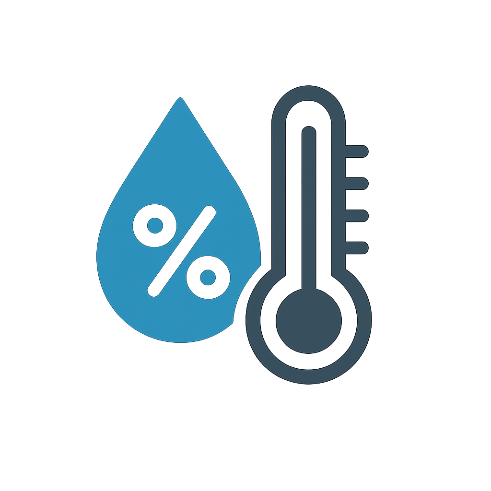

# Temperature Monitoring System



A full-stack temperature and humidity monitoring system built with ESP32, Astro, and Nix.

## Project Structure

```
.
├── apps/
│   ├── esp/          # ESP32 firmware for sensor data collection
│   │   ├── src/
│   │   │   ├── config.h        # General configuration
│   │   │   └── credentials.h   # Sensitive credentials (not in git)
│   │   └── ...
│   └── web/          # Astro web application for data visualization
├── flake.nix         # Nix flake configuration
├── .envrc            # Direnv configuration
└── README.md         # This file
```

## Development Environment Setup

### Prerequisites

- [Nix](https://nixos.org/download.html)
- [Direnv](https://direnv.net/)
- [PlatformIO](https://platformio.org/)
- [pnpm](https://pnpm.io/)

### Setup

This project uses Nix and Direnv for development environment management. After installing the prerequisites:

```bash
# Allow Direnv in the project directory
direnv allow
```

The development environment will be automatically loaded when you enter the project directory.

## ESP32 Application

The ESP32 app collects temperature and humidity data using sensors and sends it to the web application.

### Setup

1. Navigate to the ESP app directory:
   ```bash
   cd apps/esp
   ```

2. Create credentials file:
   ```bash
   cp src/credentials.example.h src/credentials.h
   ```

3. Edit `src/credentials.h` with your sensitive information:
   ```c
   // WiFi credentials
   #define WIFI_SSID "your_wifi_ssid"
   #define WIFI_PASSWORD "your_wifi_password"

   // InfluxDB configuration
   #define INFLUXDB_HOST "your-influxdb-host"
   #define INFLUXDB_PORT 443
   #define INFLUXDB_ORG "your-org-id"
   #define INFLUXDB_TOKEN "your-api-token"
   #define INFLUXDB_BUCKET "your-bucket-name"

   // Device configuration
   #define DEVICE_ID "your-device-id"
   ```

4. Set permissions for the USB device:
   ```bash
   sudo chmod 666 /dev/ttyUSB0
   ```

5. Build and upload the firmware:
   ```bash
   pio run -t upload
   ```

6. Monitor the device output:
   ```bash
   pio device monitor
   ```

### Credentials Management

The project uses a separate `credentials.h` file to manage sensitive information:

- **Purpose**: Keep sensitive credentials out of version control
- **Location**: `apps/esp/src/credentials.h`
- **Template**: `apps/esp/src/credentials.h.example`
- **Git Ignored**: The actual credentials file is in `.gitignore`

This approach:
- Prevents accidental commit of sensitive data
- Makes it easy to share the project without exposing credentials
- Allows different credentials for development and production

### Configuration

- `src/config.h`: General configuration (safe to commit)
  - Sensor settings
  - Measurement intervals
  - Debug options
- `src/credentials.h`: Sensitive information (never commit)
  - WiFi credentials (SSID and password)
  - InfluxDB configuration (host, port, org, token, bucket)
  - Device identification

## Web Application

The web app is built with Astro and provides a dashboard for monitoring sensor data.

### Setup

1. Navigate to the web app directory:
   ```bash
   cd apps/web
   ```

2. Install dependencies:
   ```bash
   pnpm install
   ```

3. Start development server:
   ```bash
   pnpm dev
   ```

4. Build for production:
   ```bash
   pnpm build
   ```

### Features

- Real-time temperature and humidity monitoring
- Historical data visualization
- PWA support for mobile devices
- Responsive design

## Deployment

### Web Application

The web application is automatically deployed to GitHub Pages when changes are pushed to the `master` branch. The deployment process:

1. Builds the application using `pnpm build`
2. Deploys the contents of `dist/` to GitHub Pages
3. The site will be available at `https://<username>.github.io/<repository-name>`

To deploy manually:
```bash
# Build the application
pnpm build

# Commit and push to master
git add .
git commit -m "Update web application"
git push origin master
```

### ESP32

1. Build the firmware:
   ```bash
   cd apps/esp
   pio run -t upload
   ```

2. Flash to device:
   ```bash
   pio device monitor
   ```