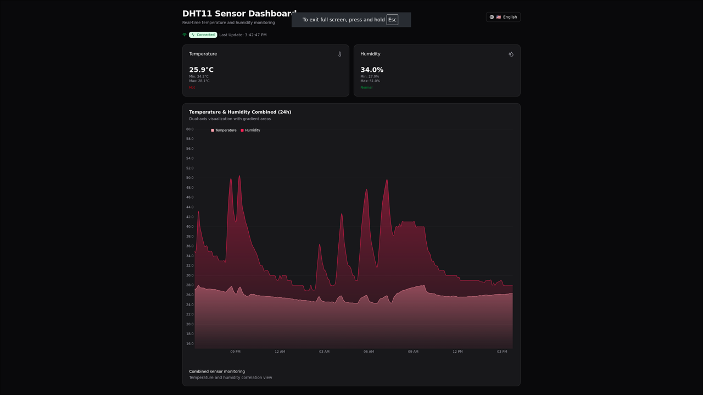

# 🌡️ Meter - IoT Sensor Monitoring System



A comprehensive IoT sensor monitoring system that collects, stores, and visualizes temperature and humidity data in real-time. Built with modern web technologies and designed for both development and production environments.

## ✨ Features

- **🌡️ Real-time Monitoring**: Live temperature and humidity data collection
- **📊 Beautiful Dashboard**: Modern, responsive web interface with dark mode
- **📱 Progressive Web App**: Works offline with service worker caching
- **🌍 Multi-language Support**: English and Bulgarian localization
- **🔌 Multiple Sensor Support**: ESP8266 and Raspberry Pi implementations
- **📈 Advanced Visualizations**: Interactive charts with gradients and tooltips
- **⚡ Time-series Database**: InfluxDB for efficient data storage
- **🎯 Production Ready**: Docker deployment with monitoring stack

## 🏗️ Architecture

The system consists of three main components:

### 📡 **Sensor Nodes**

- **ESP8266**: Low-power sensor with deep sleep mode
- **Raspberry Pi**: Continuous monitoring with GPIO access
- **DHT11 Sensors**: Temperature and humidity measurement

### 🗄️ **Data Layer**

- **InfluxDB**: Time-series database for sensor data
- **Grafana**: Advanced monitoring and alerting
- **Real-time Queries**: Efficient data retrieval and aggregation

### 🖥️ **Web Dashboard**

- **SvelteKit**: Modern frontend framework
- **ShadCN UI**: Beautiful component library
- **LayerChart**: Interactive data visualizations
- **PWA**: Progressive Web App capabilities

## 🚀 Quick Start

### Docker Deployment (Recommended)

```bash
# Clone the repository
git clone <repository-url>
cd meter

# Start all services
docker-compose up -d

# Access the dashboard
open http://localhost:8080
```

### Manual Setup

```bash
# Install dependencies
bun install

# Start development servers
bun run dev
```

## 📊 Dashboard Features

- **Real-time Updates**: Auto-refresh every 30 seconds
- **Status Indicators**: Visual alerts for temperature and humidity levels
- **Historical Data**: 24-hour trend visualization
- **Mobile Responsive**: Optimized for all device sizes
- **Offline Support**: Works without internet connection
- **Multi-language**: Switch between English and Bulgarian

## 🔧 Configuration

### Environment Variables

```env
# InfluxDB Configuration
VITE_INFLUXDB_URL=http://localhost:8086
VITE_INFLUXDB_TOKEN=your-api-token
VITE_INFLUXDB_ORG=my-org
VITE_INFLUXDB_BUCKET=sensor-data
```

### Sensor Setup

1. **ESP8266**: Connect DHT11 to GPIO D1
2. **Raspberry Pi**: Connect DHT11 to GPIO 4
3. **Configure WiFi**: Update credentials in sensor code
4. **Deploy**: Flash ESP8266 or run Python script on Pi

## 📁 Project Structure

```
meter/
├── apps/
│   ├── web/          # SvelteKit dashboard
│   ├── rp/           # Raspberry Pi sensor
│   └── esp/          # ESP8266 sensor
├── grafana/          # Monitoring dashboards
├── docker-compose.yml
└── README.md
```

## 🛠️ Technologies

- **Frontend**: SvelteKit, TypeScript, Tailwind CSS
- **Charts**: LayerChart, D3.js
- **Database**: InfluxDB
- **Monitoring**: Grafana
- **Deployment**: Docker, Docker Compose
- **Sensors**: ESP8266, Raspberry Pi, DHT11

## 🌐 Access Points

- **Dashboard**: http://localhost:8080
- **InfluxDB UI**: http://localhost:8086
- **Grafana**: http://localhost:3000

## 📈 Data Flow

1. **Sensors** collect temperature and humidity data
2. **InfluxDB** stores time-series data efficiently
3. **Dashboard** queries and visualizes data in real-time
4. **Grafana** provides advanced monitoring and alerting

## 🔒 Security

- Environment-based configuration
- Secure API token authentication
- CORS protection for web access
- Production-ready security practices

## 📱 Mobile Experience

The dashboard is fully responsive and works as a Progressive Web App:

- Install on home screen
- Offline functionality
- Push notifications (configurable)
- Native app-like experience

## 🤝 Contributing

1. Fork the repository
2. Create a feature branch
3. Make your changes
4. Test thoroughly
5. Submit a pull request

## 📄 License

This project is licensed under the MIT License - see the [LICENSE](LICENSE) file for details.

## 🆘 Support

- Check the [Docker README](README-Docker.md) for deployment details
- Review individual app READMEs for specific setup instructions
- Open an issue for bugs or feature requests

---

**Built with ❤️ for IoT enthusiasts and developers**
