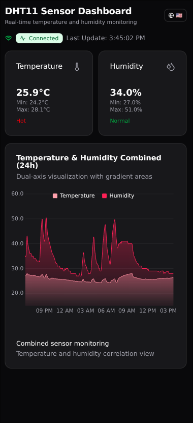

# 🌡️ Meter - IoT Sensor Monitoring System



A comprehensive IoT sensor monitoring system that collects, stores, and visualizes temperature and humidity data in real-time. Built with modern web technologies and designed for both development and production environments.

## 📋 What is Meter?

Meter is a complete IoT monitoring solution that consists of:

- **📡 Sensor Nodes**: ESP8266 and Raspberry Pi implementations for data collection
- **🗄️ Data Storage**: InfluxDB time-series database for efficient data storage
- **📊 Web Dashboard**: Modern SvelteKit application with real-time visualizations
- **📈 Monitoring**: Grafana dashboards for advanced analytics and alerting

The system is designed to be modular, allowing you to deploy individual components or the entire stack depending on your needs.

## 🏗️ Repository Structure

```
meter/
├── apps/                    # Individual applications
│   ├── web/                # SvelteKit dashboard application
│   │   ├── src/            # Source code
│   │   ├── static/         # Static assets and PWA icons
│   │   └── package.json    # Frontend dependencies
│   ├── esp/                # ESP8266 sensor implementation
│   │   ├── src/            # Arduino source code
│   │   ├── platformio.ini  # PlatformIO configuration
│   │   └── flake.nix       # Nix development environment
│   └── rp/                 # Raspberry Pi sensor implementation
│       ├── main.py         # Python sensor code
│       ├── pyproject.toml  # Python dependencies
│       └── Dockerfile      # Container configuration
├── grafana/                # Grafana dashboards and configuration
│   └── provisioning/       # Dashboard and datasource configs
├── docker-compose.yml      # Production deployment
├── docker-compose.prod.yml # Production configuration
└── README.md              # This file
```

## 🚀 Getting Started

### Quick Start with Docker (Recommended)

```bash
# Clone the repository
git clone <repository-url>
cd meter

# Start all services
docker-compose up -d

# Access the dashboard
open http://localhost:8080
```

### Individual App Setup

#### 🌐 Web Dashboard (SvelteKit)

The web dashboard is a modern Progressive Web App built with SvelteKit.

```bash
cd apps/web

# Install dependencies
bun install

# Set up environment
cp .env.example .env
# Edit .env with your InfluxDB configuration

# Start development server
bun run dev

# Build for production
bun run build
```

**Key Features:**

- Real-time data visualization with LayerChart
- Progressive Web App (PWA) with offline support
- Multi-language support (English & Bulgarian)
- Responsive design for all devices
- Dark mode support

**Technologies:**

- SvelteKit 2.x with Svelte 5 runes
- TypeScript for type safety
- Tailwind CSS for styling
- LayerChart for data visualization
- InfluxDB client for data fetching
- PWA capabilities with service worker

#### 📡 ESP8266 Sensor

Low-power sensor implementation using Arduino framework.

```bash
cd apps/esp

# Install PlatformIO CLI (if not installed)
pip install platformio

# Configure credentials
cp src/credentials.example.h src/credentials.h
# Edit src/credentials.h with your WiFi and InfluxDB settings

# Build and upload
pio run --target upload

# Monitor serial output
pio device monitor
```

**Key Features:**

- Deep sleep mode for low power consumption
- DHT11 sensor support on GPIO D1
- Automatic WiFi reconnection
- Configurable measurement intervals
- Error handling with retry logic

**Technologies:**

- Arduino framework for ESP8266
- PlatformIO for development environment
- DHT sensor library
- WiFi and HTTP client libraries
- Nix development environment

#### 🍓 Raspberry Pi Sensor

Python-based sensor implementation for continuous monitoring.

```bash
cd apps/rp

# Install dependencies
uv sync
# or pip install -r requirements.txt

# Configure environment
export INFLUXDB_URL="http://localhost:8086"
export INFLUXDB_TOKEN="your-token"
export INFLUXDB_ORG="your-org"
export INFLUXDB_BUCKET="sensor-data"

# Run the sensor
python main.py
```

**Key Features:**

- Continuous monitoring (no sleep mode)
- GPIO access for DHT11 sensor
- Docker support for easy deployment
- Configurable measurement intervals
- Robust error handling

**Technologies:**

- Python 3.11+
- Adafruit CircuitPython DHT library
- RPi.GPIO for hardware access
- InfluxDB Python client
- Docker containerization

## 🛠️ Technology Stack

### Frontend (Web Dashboard)

- **Framework**: SvelteKit 2.x with Svelte 5 runes
- **Language**: TypeScript
- **Styling**: Tailwind CSS 4.x
- **Charts**: LayerChart with D3.js
- **UI Components**: ShadCN Svelte
- **Icons**: Lucide Svelte
- **Internationalization**: Paraglide JS
- **Build Tool**: Vite
- **Package Manager**: Bun

### Backend & Data

- **Database**: InfluxDB (time-series)
- **Monitoring**: Grafana
- **Containerization**: Docker & Docker Compose
- **Development**: Nix (flake.nix)

### Hardware & Sensors

- **Microcontrollers**: ESP8266 (NodeMCU, Wemos D1 Mini)
- **Single Board Computers**: Raspberry Pi
- **Sensors**: DHT11 (temperature & humidity)
- **Development**: PlatformIO (ESP8266), Python (Raspberry Pi)

### DevOps & Deployment

- **Container Orchestration**: Docker Compose
- **Environment Management**: Nix flakes
- **Package Management**: Bun (Node.js), uv (Python)
- **Static Hosting**: Vite adapter-static

## 📊 Data Flow

1. **Sensors** (ESP8266/Raspberry Pi) collect temperature and humidity data
2. **InfluxDB** stores time-series data with location and device tags
3. **Web Dashboard** queries InfluxDB and displays real-time visualizations
4. **Grafana** provides advanced monitoring, alerting, and analytics

## 🔧 Configuration

### Environment Variables

```env
# InfluxDB Configuration
VITE_INFLUXDB_URL=http://localhost:8086
VITE_INFLUXDB_TOKEN=your-api-token
VITE_INFLUXDB_ORG=my-org
VITE_INFLUXDB_BUCKET=sensor-data
VITE_INFLUXDB_MEASUREMENT=dht11_reading
```

### Hardware Setup

1. **ESP8266**: Connect DHT11 to GPIO D1 (GPIO 5)
2. **Raspberry Pi**: Connect DHT11 to GPIO 4
3. **Power**: 3.3V supply for sensors
4. **WiFi**: Configure network credentials in sensor code

## 🌐 Access Points

- **Dashboard**: http://localhost:8080
- **InfluxDB UI**: http://localhost:8086
- **Grafana**: http://localhost:3000

## 📱 Mobile Experience

The dashboard is fully responsive and works as a Progressive Web App:

- Install on home screen
- Offline functionality
- Push notifications (configurable)
- Native app-like experience

## 🔒 Security

- Environment-based configuration
- Secure API token authentication
- CORS protection for web access
- Production-ready security practices

## 🤝 Contributing

1. Fork the repository
2. Create a feature branch
3. Make your changes
4. Test thoroughly
5. Submit a pull request

## 📄 License

This project is licensed under the MIT License - see the [LICENSE](LICENSE) file for details.

## 🆘 Support

- Check the [Docker README](README-Docker.md) for deployment details
- Review individual app READMEs for specific setup instructions
- Open an issue for bugs or feature requests

---

**Built with ❤️ for IoT enthusiasts and developers**
